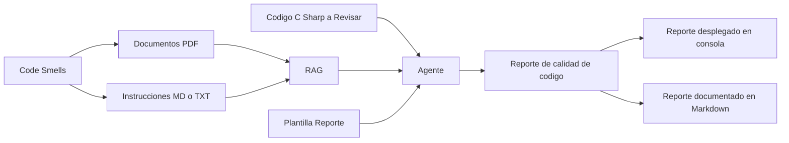

# Agente Patito de Hule

## Tabla de Contenidos

- [Introducción](#introducción)
- [Skills](#skills)
  - [`find-code-smells`](#find-code-smells)
  - [`fix-code-smells`](#fix-code-smells)
  - [`generate-clean-code-report`](#generate-clean-code-report)
- [Herramientas](#herramientas)
  - [`read_file` — Leer archivo](#read_file--leer-archivo)
  - [`write_file` — Escribir / manipular archivos](#write_file--escribir--manipular-archivos)
  - [`list_files` — Listar archivos](#list_files--listar-archivos)
  - [`run_git_command` — Comandos Git *(opcional)*](#run_git_command--comandos-git-opcional)
- [RAG](#rag)
  - [Mapeo Code Smell → Patrón de Diseño](#mapeo-code-smell--patrón-de-diseño)
- [Principios de Calidad que el Agente Evalúa](#principios-de-calidad-que-el-agente-evalúa)
- [Catálogo de Code Smells Detectables](#catálogo-de-code-smells-detectables)
- [Salidas](#salidas)
- [Ejemplos de Reportes](#ejemplos-de-reportes)
  - [Ejemplo 1: Comentarios Excesivos y Número Mágico](#ejemplo-1-comentarios-excesivos-y-número-mágico)
  - [Ejemplo 2: Malos Nombres y Función Engañosa](#ejemplo-2-malos-nombres-y-función-engañosa)
  - [Ejemplo 3: Lista de Parámetros Larga y Obsesión Primitiva](#ejemplo-3-lista-de-parámetros-larga-y-obsesión-primitiva)
  - [Ejemplo 4: Clase Dios](#ejemplo-4-clase-dios)
  - [Ejemplo 5: Acoplamiento Excesivo *(Feature Envy)*](#ejemplo-5-acoplamiento-excesivo-feature-envy)
  - [Ejemplo 6: Clase Incompleta / Sin Cohesión *(Lazy Class)*](#ejemplo-6-clase-incompleta--sin-cohesión-lazy-class)
  - [Ejemplo 7: Código Duplicado](#ejemplo-7-código-duplicado)
  - [Ejemplo 8: Switch Statements / Complejidad Condicional](#ejemplo-8-switch-statements--complejidad-condicional)

## Introducción

Agente hecho para revisar código en busca de *code smells*. Identifica malas prácticas, explica cada problema al usuario, sugiere los cambios necesarios y genera un reporte con una evaluación de la calidad del código.



## Skills

El agente cuenta con las siguientes habilidades especializadas. Cada skill representa una capacidad atómica que puede invocarse de forma independiente o encadenada en un flujo completo de revisión.

### `find-code-smells`

**Propósito:** Analizar un archivo o fragmento de código C# e identificar todos los *code smells* presentes.

**Entradas:**
- Ruta del archivo a revisar (o fragmento de código en texto plano).
- Contexto opcional: nombre del ticket, requisitos del sprint o criterios de aceptación.

**Proceso:**
1. Leer el archivo fuente.
2. Consultar el RAG para contrastar el código contra el catálogo de code smells y los principios KISS, DRY, YAGNI y SOLID.
3. Por cada smell detectado, registrar: ubicación (clase/método/línea), tipo de smell, principio violado y severidad (Alta / Media / Baja).

**Salida:** Lista estructurada de hallazgos lista para ser consumida por `fix-code-smells` o `generate-clean-code-report`.

---

### `fix-code-smells`

**Propósito:** Para cada hallazgo producido por `find-code-smells`, generar una sugerencia de refactorización concreta con código corregido.

**Entradas:**
- Lista de hallazgos de `find-code-smells`.
- Archivo fuente original.

**Proceso:**
1. Iterar sobre cada smell detectado.
2. Consultar el RAG para seleccionar el patrón de refactorización apropiado (Extract Method, Strategy, Parameter Object, etc.).
3. Producir el fragmento de código corregido respetando el estilo del proyecto (convenciones de nombres, indentación, versión de C#).
4. Anotar el principio que se recupera con el cambio y el impacto esperado (mantenibilidad, legibilidad, testabilidad).

**Salida:** Conjunto de pares `{código original → código sugerido}` por cada hallazgo, listos para incluirse en el reporte.

---

### `generate-clean-code-report`

**Propósito:** Consolidar los hallazgos y sugerencias en un reporte estructurado con una evaluación global del código.

**Entradas:**
- Lista de hallazgos de `find-code-smells`.
- Sugerencias de `fix-code-smells`.
- Plantilla de reporte (Markdown).

**Proceso:**
1. Calcular el score de calidad (0–100) con base en la cantidad y severidad de los smells encontrados.
2. Asignar una recomendación global: `APROBADO`, `REQUIERE REFACTORIZACIÓN` o `RECHAZADO`.
3. Renderizar el reporte según la plantilla: resumen ejecutivo, hallazgos por severidad, tabla de evaluación y checklist de mejoras.
4. Escribir el reporte como archivo `.md` y/o desplegarlo en consola.

**Salida:** Archivo `reporte-<nombre-archivo>-<fecha>.md` y/o salida en consola.

---

## Herramientas

El agente requiere acceso a las siguientes herramientas para ejecutar sus skills.

### `read_file` — Leer archivo

**Propósito:** Leer el contenido de cualquier archivo del sistema de archivos local.

**Usos:**
- Cargar el archivo de código fuente a revisar (`.cs`).
- Cargar la plantilla de reporte (`.md`).
- Leer instrucciones o contexto adicional (`.txt`, `.md`).
- Leer documentos del RAG (`.pdf`, `.md`).

---

### `write_file` — Escribir / manipular archivos

**Propósito:** Crear o sobreescribir archivos en el sistema de archivos local.

**Usos:**
- Generar el reporte de calidad como archivo `reporte-<nombre>-<fecha>.md`.
- (Opcional) Escribir la versión refactorizada del archivo fuente si se solicita aplicar los cambios directamente.

---

### `list_files` — Listar archivos

**Propósito:** Explorar la estructura de directorios del proyecto.

**Usos:**
- Descubrir todos los archivos `.cs` de un proyecto o módulo para una revisión masiva.
- Verificar que el reporte fue generado en la ruta correcta.

---

### `run_git_command` — Comandos Git *(opcional)*

**Propósito:** Interactuar con el repositorio Git del proyecto.

**Usos:**
- Crear o cambiar a un branch de revisión (e.g. `code-review/<ticket>`).
- Hacer commit del reporte generado con un mensaje descriptivo (e.g. `docs: agrega reporte de code smells para OrderService`).
- Hacer commit de los cambios refactorizados si se aplicaron directamente.

> **Nota:** Esta herramienta es opcional. Solo se activa si el usuario lo solicita explícitamente.

---

## RAG

Documentos indexados que el agente consulta para fundamentar cada hallazgo y sugerencia.

| # | Documento | Uso principal |
|---|---|---|
| 1 | Martin, R. C. (2008). *Clean Code: A Handbook of Agile Software Craftsmanship*. Prentice Hall. | Definiciones canónicas de code smells, reglas de nombrado, principios de funciones y clases. |
| 2 | Resumen de principios: KISS, DRY, YAGNI, SOLID | Referencia rápida de los principios que el agente contrasta contra el código revisado. |
| 3 | Catálogo de code smells detectables (este documento) | Mapeo de smells → principios violados → severidad → refactorizaciones recomendadas. |
| 4 | Gamma, E., Helm, R., Johnson, R., & Vlissides, J. (1994). *Design Patterns: Elements of Reusable Object-Oriented Software*. Addison-Wesley. | Patrones creacionales, estructurales y de comportamiento que el agente sugiere como refactorizaciones (Strategy, Factory, Decorator, Observer, etc.). |
| 5 | Resumen de patrones de diseño aplicables a refactorizaciones comunes | Mapeo rápido de code smell → patrón de diseño recomendado (e.g. Switch Statement → Strategy, God Class → Facade/Service, Primitive Obsession → Value Object). |

### Mapeo Code Smell → Patrón de Diseño

El agente usa la siguiente tabla al generar sugerencias en `fix-code-smells` para recomendar el patrón más apropiado según el smell detectado.

| Code Smell | Patrón(es) Recomendado(s) | Categoría del Patrón |
|---|---|---|
| Switch Statement / Complejidad Condicional | **Strategy**, **Command** | Comportamiento |
| Clase Dios *(God Class)* | **Facade**, separación en servicios (SRP) | Estructural |
| Obsesión Primitiva | **Value Object**, **Money**, **Quantity** | Creacional / DDD |
| Acoplamiento Excesivo *(Feature Envy)* | **Decorator**, **Visitor** | Estructural / Comportamiento |
| Código Duplicado en creación de objetos | **Factory Method**, **Abstract Factory** | Creacional |
| Dependencia directa de implementaciones | **Dependency Injection**, **Abstract Factory** | Creacional |
| Notificaciones y reacciones acopladas | **Observer**, **Event Aggregator** | Comportamiento |
| Clases con muchos métodos opcionales | **Decorator**, **Null Object** | Estructural |
| Construcción compleja de objetos | **Builder** | Creacional |
| Múltiples variantes de un algoritmo | **Template Method** | Comportamiento |

---

## Principios de Calidad que el Agente Evalúa

El agente verifica el cumplimiento de los siguientes principios en cada revisión:

| Principio | Descripción |
|---|---|
| **KISS** *(Keep It Simple, Stupid)* | El código debe ser lo más simple posible. Evitar soluciones innecesariamente complejas. |
| **DRY** *(Don't Repeat Yourself)* | Cada pieza de conocimiento debe tener una única representación en el sistema. No duplicar lógica. |
| **YAGNI** *(You Aren't Gonna Need It)* | No implementar funcionalidad que no se necesita hoy. Evitar sobre-ingeniería. |
| **SRP** *(Single Responsibility Principle)* | Una clase o método debe tener una sola razón para cambiar. |
| **OCP** *(Open/Closed Principle)* | El código debe estar abierto a extensión y cerrado a modificación. |
| **LSP** *(Liskov Substitution Principle)* | Los subtipos deben ser sustituibles por sus tipos base sin alterar el comportamiento. |
| **ISP** *(Interface Segregation Principle)* | Preferir interfaces pequeñas y específicas sobre interfaces grandes y generales. |
| **DIP** *(Dependency Inversion Principle)* | Depender de abstracciones, no de implementaciones concretas. |

---

## Catálogo de Code Smells Detectables

| # | Code Smell | Principio Violado | Severidad Típica |
|---|---|---|---|
| 1 | Comentarios excesivos o redundantes | KISS | Baja |
| 2 | Números mágicos | DRY, KISS | Media |
| 3 | Malos nombres (notación húngara, abreviaturas, nombres engañosos) | KISS | Media |
| 4 | Función que hace más de lo que su nombre indica | SRP, KISS | Alta |
| 5 | Lista de parámetros larga | SRP, KISS | Media |
| 6 | Clase Dios *(God Class)* | SRP, DRY | Alta |
| 7 | Obsesión primitiva *(Primitive Obsession)* | SRP, OCP | Media |
| 8 | Acoplamiento excesivo *(Feature Envy / Inappropriate Intimacy)* | DIP, SRP | Alta |
| 9 | Clases incompletas o sin cohesión *(Lazy Class / Incomplete Class)* | YAGNI, SRP | Baja |
| 10 | Código duplicado | DRY | Alta |
| 11 | Ausencia de validación de entrada | SRP | Media |
| 12 | Violación de SRP (clase con múltiples responsabilidades) | SRP | Alta |
| 13 | Switch Statements / Complejidad Condicional *(Conditional Complexity)* | OCP, SRP | Alta |

---

## Salidas

Reporte con los *code smells* encontrados. Incluye:

- Descripción del problema con fragmento de código.
- Principio violado.
- Grado de severidad (Alta, Media, Baja).
- Sugerencia de cambio con código corregido.
- Evaluación global del código (score 0–100).

---

## Ejemplos de Reportes

---

### Ejemplo 1: Comentarios Excesivos y Número Mágico

Archivo: `ExcessiveComments.cs`

#### Resumen Ejecutivo

- **Score de Calidad:** 62/100 ⚠️
- **Code Smells Encontrados:** 4
- **Recomendación:** REQUIERE REFACTORIZACIÓN

**Descripción general:**
En `InvoiceCalculator` se identificaron comentarios que repiten lo que el código ya expresa, un número mágico, ausencia de validación de entrada y mezcla de responsabilidades.

#### Code Smells Encontrados

##### 1. Comentarios Excesivos
**Severidad:** BAJA 🟡 | **Principio violado:** KISS

**Problema:**
```csharp
public decimal CalculateTotal(List<InvoiceItem> items)
{
    // Initialize total to zero.
    decimal total = 0;

    // Loop through every invoice item.
    foreach (var item in items)
    {
        // Multiply quantity by unit price.
        decimal subtotal = item.Quantity * item.UnitPrice;

        // Add subtotal to total.
        total += subtotal;
    }

    // Return the calculated total.
    return total;
}
```

**Sugerencia:**
Eliminar los comentarios que describen lo que el código ya expresa. El código limpio se explica solo.

```csharp
public decimal CalculateTotal(List<InvoiceItem> items)
{
    decimal total = 0;
    foreach (var item in items)
        total += item.Quantity * item.UnitPrice;
    return total;
}
```

---

##### 2. Número Mágico
**Severidad:** MEDIA 🟠 | **Principio violado:** DRY, KISS

**Problema:**
```csharp
public bool HasDiscount(decimal total)
{
    return total > 1000;
}
```

**Sugerencia:**
Extraer el valor literal a una constante con nombre descriptivo.

```csharp
private const decimal DiscountThreshold = 1000m;

public bool HasDiscount(decimal total) => total > DiscountThreshold;
```

---

##### 3. Ausencia de Validación de Entrada
**Severidad:** MEDIA 🟠 | **Principio violado:** SRP

**Problema:**
`CalculateTotal` no valida si `items` es `null`, causando `NullReferenceException` en tiempo de ejecución.

**Sugerencia:**
```csharp
public decimal CalculateTotal(List<InvoiceItem> items)
{
    if (items == null || items.Count == 0)
        return 0m;
    return items.Sum(i => i.Quantity * i.UnitPrice);
}
```

---

##### 4. Violación de SRP
**Severidad:** ALTA 🔴 | **Principio violado:** SRP

**Problema:**
`InvoiceCalculator` mezcla el cálculo del total con la lógica de descuento.

**Sugerencia:**
```csharp
public class InvoiceCalculator
{
    public decimal CalculateTotal(List<InvoiceItem> items)
    {
        if (items == null || items.Count == 0) return 0m;
        return items.Sum(i => i.Quantity * i.UnitPrice);
    }
}

public class DiscountService
{
    private const decimal DiscountThreshold = 1000m;
    public bool HasDiscount(decimal total) => total > DiscountThreshold;
}
```

---

#### 📊 Evaluación

| Code Smell | Principio Violado | Severidad | Estado |
|---|---|---|---|
| Comentarios excesivos | KISS | Baja | ⚠️ |
| Número mágico | DRY, KISS | Media | ⚠️ |
| Validación de entrada ausente | SRP | Media | ⚠️ |
| Violación de SRP | SRP | Alta | ❌ |

#### ✅ Checklist de Mejoras

- [ ] Eliminar comentarios que repiten lo que hace el código
- [ ] Extraer `1000` a una constante con nombre descriptivo
- [ ] Agregar validación de `null` y lista vacía en `CalculateTotal`
- [ ] Separar la lógica de descuento en una clase dedicada

---

### Ejemplo 2: Malos Nombres y Función Engañosa

Archivo: `UserManager.cs`

#### Resumen Ejecutivo

- **Score de Calidad:** 48/100 ❌
- **Code Smells Encontrados:** 3
- **Recomendación:** REQUIERE REFACTORIZACIÓN

**Descripción general:**
El código usa notación húngara, abreviaturas crípticas y un método cuyo nombre promete solo lectura/evaluación pero también ejecuta una actualización, violando el principio de menor sorpresa.

#### Code Smells Encontrados

##### 1. Notación Húngara y Abreviaturas
**Severidad:** MEDIA 🟠 | **Principio violado:** KISS

**Problema:**
Los nombres de variables incluyen el tipo como prefijo (`strName`, `intAge`, `bIsActive`) y abreviaturas que no comunican intención (`usrMgr`, `proc`, `val`).

```csharp
public class UserManager
{
    public void proc(string strName, int intAge, bool bIsActive)
    {
        string strFullNm = strName.Trim();
        int val = intAge > 0 ? intAge : 0;
        bool bFlag = bIsActive && val >= 18;

        var usrMgr = new UserRepository();
        usrMgr.Save(strFullNm, val, bFlag);
    }
}
```

**Sugerencia:**
Usar nombres que expresen intención, sin prefijos de tipo ni abreviaturas.

```csharp
public class UserManager
{
    public void RegisterUser(string name, int age, bool isActive)
    {
        string trimmedName = name.Trim();
        int sanitizedAge = age > 0 ? age : 0;
        bool isEligible = isActive && sanitizedAge >= 18;

        _userRepository.Save(trimmedName, sanitizedAge, isEligible);
    }
}
```

---

##### 2. Nombre de Función Engañoso
**Severidad:** ALTA 🔴 | **Principio violado:** SRP, KISS

**Problema:**
El método se llama `EvaluateUser` pero además de evaluar actualiza el estado del usuario en la base de datos. El nombre promete solo una consulta y entrega un efecto secundario oculto.

```csharp
public bool EvaluateUser(int userId)
{
    var user = _repo.GetById(userId);
    bool isValid = user.Age >= 18 && user.IsActive;

    // Efecto secundario oculto: actualiza el estado
    user.LastEvaluated = DateTime.UtcNow;
    _repo.Update(user);

    return isValid;
}
```

**Sugerencia:**
Separar la evaluación de la actualización en dos métodos con nombres honestos.

```csharp
public bool IsUserEligible(int userId)
{
    var user = _repo.GetById(userId);
    return user.Age >= 18 && user.IsActive;
}

public void RecordEvaluation(int userId)
{
    var user = _repo.GetById(userId);
    user.LastEvaluated = DateTime.UtcNow;
    _repo.Update(user);
}
```

---

##### 3. Nombre de Variable Sin Intención
**Severidad:** BAJA 🟡 | **Principio violado:** KISS

**Problema:**
```csharp
var x = _repo.GetAll();
var temp = x.Where(u => u.IsActive).ToList();
var result = temp.Count;
```

**Sugerencia:**
```csharp
var allUsers = _repo.GetAll();
var activeUsers = allUsers.Where(u => u.IsActive).ToList();
var activeUserCount = activeUsers.Count;
```

---

#### 📊 Evaluación

| Code Smell | Principio Violado | Severidad | Estado |
|---|---|---|---|
| Notación húngara y abreviaturas | KISS | Media | ⚠️ |
| Función engañosa (evalúa y actualiza) | SRP, KISS | Alta | ❌ |
| Variables sin intención (`x`, `temp`, `result`) | KISS | Baja | ⚠️ |

#### ✅ Checklist de Mejoras

- [ ] Renombrar variables eliminando prefijos de tipo y abreviaturas
- [ ] Separar `EvaluateUser` en `IsUserEligible` y `RecordEvaluation`
- [ ] Renombrar `x`, `temp`, `result` con nombres descriptivos

---

### Ejemplo 3: Lista de Parámetros Larga y Obsesión Primitiva

Archivo: `OrderService.cs`

#### Resumen Ejecutivo

- **Score de Calidad:** 52/100 ⚠️
- **Code Smells Encontrados:** 2
- **Recomendación:** REQUIERE REFACTORIZACIÓN

**Descripción general:**
El método `CreateOrder` recibe siete parámetros primitivos en lugar de un objeto de dominio, y la dirección de envío se representa con cuatro `string` sueltos en lugar de un tipo cohesionado.

#### Code Smells Encontrados

##### 1. Lista de Parámetros Larga *(Long Parameter List)*
**Severidad:** MEDIA 🟠 | **Principio violado:** SRP, KISS

**Problema:**
Siete parámetros hacen que la firma sea difícil de leer, difícil de llamar en el orden correcto y frágil ante cambios.

```csharp
public Order CreateOrder(
    int customerId,
    string productCode,
    int quantity,
    string street,
    string city,
    string state,
    string zipCode)
{
    // ...
}
```

**Sugerencia:**
Agrupar los parámetros relacionados en objetos de parámetro (*Parameter Object*).

```csharp
public Order CreateOrder(int customerId, OrderRequest request)
{
    // ...
}

public record OrderRequest(string ProductCode, int Quantity, Address ShippingAddress);
```

---

##### 2. Obsesión Primitiva *(Primitive Obsession)*
**Severidad:** MEDIA 🟠 | **Principio violado:** SRP, OCP

**Problema:**
La dirección se maneja como cuatro cadenas sueltas, sin ningún tipo que agrupe su lógica de validación ni exprese su semántica.

```csharp
string street = "Av. Reforma 123";
string city   = "CDMX";
string state  = "Ciudad de México";
string zip    = "06600";

// Validación dispersa por todo el código
if (zip.Length != 5) throw new Exception("Invalid zip");
```

**Sugerencia:**
Crear un tipo `Address` que encapsule los datos y su validación.

```csharp
public record Address(string Street, string City, string State, string ZipCode)
{
    public Address
    {
        if (ZipCode.Length != 5)
            throw new ArgumentException("El código postal debe tener 5 dígitos.", nameof(ZipCode));
    }
}
```

---

#### 📊 Evaluación

| Code Smell | Principio Violado | Severidad | Estado |
|---|---|---|---|
| Lista de parámetros larga (7 params) | SRP, KISS | Media | ⚠️ |
| Obsesión primitiva (dirección en 4 strings) | SRP, OCP | Media | ⚠️ |

#### ✅ Checklist de Mejoras

- [ ] Crear `OrderRequest` como *Parameter Object*
- [ ] Crear tipo `Address` que encapsule validación del código postal
- [ ] Actualizar los llamadores para pasar los nuevos objetos

---

### Ejemplo 4: Clase Dios

Archivo: `ApplicationManager.cs`

#### Resumen Ejecutivo

- **Score de Calidad:** 30/100 ❌
- **Code Smells Encontrados:** 1
- **Recomendación:** REQUIERE REFACTORIZACIÓN PROFUNDA

**Descripción general:**
`ApplicationManager` concentra lógica de autenticación, envío de correos, acceso a base de datos y generación de reportes en una sola clase. Cualquier cambio en cualquiera de esas áreas obliga a modificar esta clase.

#### Code Smells Encontrados

##### 1. Clase Dios *(God Class)*
**Severidad:** ALTA 🔴 | **Principio violado:** SRP, DRY, DIP

**Problema:**
```csharp
public class ApplicationManager
{
    // Autenticación
    public bool Login(string user, string pass) { /* ... */ }
    public void Logout(int userId) { /* ... */ }

    // Base de datos
    public List<User> GetAllUsers() { /* ... */ }
    public void SaveUser(User u) { /* ... */ }
    public void DeleteUser(int id) { /* ... */ }

    // Email
    public void SendWelcomeEmail(string to) { /* ... */ }
    public void SendPasswordReset(string to, string token) { /* ... */ }

    // Reportes
    public byte[] GeneratePdfReport(int month) { /* ... */ }
    public string GenerateCsvExport() { /* ... */ }
}
```

**Sugerencia:**
Dividir en servicios especializados con responsabilidad única, agrupados por dominio.

```csharp
public class AuthService
{
    public bool Login(string user, string pass) { /* ... */ }
    public void Logout(int userId) { /* ... */ }
}

public class UserRepository
{
    public List<User> GetAll() { /* ... */ }
    public void Save(User u) { /* ... */ }
    public void Delete(int id) { /* ... */ }
}

public class EmailService
{
    public void SendWelcome(string to) { /* ... */ }
    public void SendPasswordReset(string to, string token) { /* ... */ }
}

public class ReportService
{
    public byte[] GeneratePdf(int month) { /* ... */ }
    public string GenerateCsv() { /* ... */ }
}
```

---

#### 📊 Evaluación

| Code Smell | Principio Violado | Severidad | Estado |
|---|---|---|---|
| Clase Dios (4 dominios en 1 clase) | SRP, DRY, DIP | Alta | ❌ |

#### ✅ Checklist de Mejoras

- [ ] Extraer `AuthService` con la lógica de autenticación
- [ ] Extraer `UserRepository` con el acceso a datos
- [ ] Extraer `EmailService` con el envío de correos
- [ ] Extraer `ReportService` con la generación de reportes
- [ ] Inyectar las dependencias vía constructor (DIP)

---

### Ejemplo 5: Acoplamiento Excesivo *(Feature Envy)*

Archivo: `InvoicePrinter.cs`

#### Resumen Ejecutivo

- **Score de Calidad:** 55/100 ⚠️
- **Code Smells Encontrados:** 1
- **Recomendación:** REQUIERE REFACTORIZACIÓN

**Descripción general:**
`InvoicePrinter` accede constantemente a los datos internos de `Customer` para hacer cálculos que le pertenecen a esa clase, en lugar de pedirle a `Customer` que resuelva su propio comportamiento.

#### Code Smells Encontrados

##### 1. Acoplamiento Excesivo / Feature Envy
**Severidad:** ALTA 🔴 | **Principio violado:** SRP, DIP, OCP

**Problema:**
```csharp
public class InvoicePrinter
{
    public string GetCustomerLabel(Customer customer)
    {
        // InvoicePrinter "envidia" la clase Customer:
        // hace demasiado trabajo con datos ajenos
        string label = customer.FirstName + " " + customer.LastName;
        if (customer.IsPremium)
            label = "[VIP] " + label;
        if (customer.DiscountRate > 0)
            label += $" ({customer.DiscountRate * 100}% desc.)";
        return label;
    }
}
```

**Sugerencia:**
Mover la lógica al tipo al que pertenecen los datos.

```csharp
public class Customer
{
    public string FirstName { get; set; }
    public string LastName { get; set; }
    public bool IsPremium { get; set; }
    public decimal DiscountRate { get; set; }

    public string GetDisplayLabel()
    {
        string label = $"{FirstName} {LastName}";
        if (IsPremium) label = "[VIP] " + label;
        if (DiscountRate > 0) label += $" ({DiscountRate * 100}% desc.)";
        return label;
    }
}

public class InvoicePrinter
{
    public string GetCustomerLabel(Customer customer) => customer.GetDisplayLabel();
}
```

---

#### 📊 Evaluación

| Code Smell | Principio Violado | Severidad | Estado |
|---|---|---|---|
| Feature Envy en `InvoicePrinter` | SRP, DIP, OCP | Alta | ❌ |

#### ✅ Checklist de Mejoras

- [ ] Mover `GetCustomerLabel` como `GetDisplayLabel` dentro de `Customer`
- [ ] Reducir `InvoicePrinter` a delegar la llamada

---

### Ejemplo 6: Clase Incompleta / Sin Cohesión *(Lazy Class)*

Archivo: `DateHelper.cs`

#### Resumen Ejecutivo

- **Score de Calidad:** 70/100 ✅
- **Code Smells Encontrados:** 1
- **Recomendación:** REFACTORIZACIÓN MENOR

**Descripción general:**
`DateHelper` existe como clase propia pero solo contiene un método estático que envuelve una operación estándar de la plataforma. No justifica su existencia como abstracción.

#### Code Smells Encontrados

##### 1. Clase Incompleta / Lazy Class
**Severidad:** BAJA 🟡 | **Principio violado:** YAGNI, KISS

**Problema:**
```csharp
public class DateHelper
{
    public static string FormatDate(DateTime date)
    {
        return date.ToString("yyyy-MM-dd");
    }
}
```

Esta clase existe solo para envolver `ToString`, no agrega abstracción ni comportamiento de dominio.

**Sugerencia:**
Eliminar la clase y usar directamente el método estándar, o si el formato es un contrato de negocio, convertirlo en una constante o método de extensión.

```csharp
// Opción A: método de extensión cohesionado con otros helpers de fecha
public static class DateExtensions
{
    public static string ToIsoDate(this DateTime date) => date.ToString("yyyy-MM-dd");
}

// Uso
string formatted = order.CreatedAt.ToIsoDate();
```

---

#### 📊 Evaluación

| Code Smell | Principio Violado | Severidad | Estado |
|---|---|---|---|
| Clase sin cohesión (`DateHelper`) | YAGNI, KISS | Baja | ⚠️ |

#### ✅ Checklist de Mejoras

- [ ] Eliminar `DateHelper` y reemplazar con método de extensión o uso directo

---

### Ejemplo 7: Código Duplicado

Archivo: `ReportService.cs`

#### Resumen Ejecutivo

- **Score de Calidad:** 45/100 ❌
- **Code Smells Encontrados:** 1
- **Recomendación:** REQUIERE REFACTORIZACIÓN

**Descripción general:**
La lógica de filtrado de usuarios activos por rango de fechas está copiada y pegada en tres métodos distintos. Un cambio en la regla de filtrado obliga a modificar los tres sitios.

#### Code Smells Encontrados

##### 1. Código Duplicado *(Duplicated Code)*
**Severidad:** ALTA 🔴 | **Principio violado:** DRY

**Problema:**
```csharp
public List<User> GetMonthlyActiveUsers(int month)
{
    return _users
        .Where(u => u.IsActive && u.LastLogin.Month == month)
        .ToList();
}

public int CountMonthlyActiveUsers(int month)
{
    return _users
        .Where(u => u.IsActive && u.LastLogin.Month == month)
        .Count();
}

public decimal AverageAgeOfMonthlyActiveUsers(int month)
{
    return _users
        .Where(u => u.IsActive && u.LastLogin.Month == month)
        .Average(u => u.Age);
}
```

**Sugerencia:**
Extraer el filtro común a un método privado y reutilizarlo (DRY).

```csharp
private IEnumerable<User> GetActiveUsersForMonth(int month) =>
    _users.Where(u => u.IsActive && u.LastLogin.Month == month);

public List<User> GetMonthlyActiveUsers(int month) =>
    GetActiveUsersForMonth(month).ToList();

public int CountMonthlyActiveUsers(int month) =>
    GetActiveUsersForMonth(month).Count();

public decimal AverageAgeOfMonthlyActiveUsers(int month) =>
    GetActiveUsersForMonth(month).Average(u => u.Age);
```

---

#### 📊 Evaluación

| Code Smell | Principio Violado | Severidad | Estado |
|---|---|---|---|
| Filtro duplicado en 3 métodos | DRY | Alta | ❌ |

#### ✅ Checklist de Mejoras

- [ ] Extraer `GetActiveUsersForMonth` como método privado compartido
- [ ] Verificar en el resto del codebase si el mismo filtro se repite en otras clases

---

### Ejemplo 8: Switch Statements / Complejidad Condicional

Archivo: `ShippingCalculator.cs`

#### Resumen Ejecutivo

- **Score de Calidad:** 40/100 ❌
- **Code Smells Encontrados:** 2
- **Recomendación:** REQUIERE REFACTORIZACIÓN

**Descripción general:**
El cálculo de envío usa un `switch` largo para determinar el costo según el tipo de envío, y un bloque de `if/else if` encadenado para aplicar descuentos según el tipo de cliente. Ambas estructuras crecen cada vez que se agrega un nuevo tipo, violando OCP: hay que modificar código existente en lugar de extenderlo.

#### Code Smells Encontrados

##### 1. Switch Statement para Despacho de Comportamiento
**Severidad:** ALTA 🔴 | **Principio violado:** OCP, SRP

**Problema:**
Cada nuevo tipo de envío o cliente obliga a abrir este método y agregar un `case` más. Si la lógica de cada caso crece, el método se convierte rápidamente en una God Method.

```csharp
public decimal CalculateShippingCost(string shippingType, decimal orderTotal)
{
    decimal cost;

    switch (shippingType)
    {
        case "Standard":
            cost = 5.00m;
            break;
        case "Express":
            cost = 15.00m;
            break;
        case "Overnight":
            cost = 30.00m;
            break;
        case "International":
            cost = 50.00m;
            break;
        default:
            throw new ArgumentException($"Tipo de envío desconocido: {shippingType}");
    }

    return cost;
}
```

**Sugerencia:**
Reemplazar el `switch` con polimorfismo. Cada estrategia de envío encapsula su propio costo (OCP: abierto a extensión, cerrado a modificación).

```csharp
public interface IShippingStrategy
{
    decimal CalculateCost(decimal orderTotal);
}

public class StandardShipping : IShippingStrategy
{
    public decimal CalculateCost(decimal orderTotal) => 5.00m;
}

public class ExpressShipping : IShippingStrategy
{
    public decimal CalculateCost(decimal orderTotal) => 15.00m;
}

public class OvernightShipping : IShippingStrategy
{
    public decimal CalculateCost(decimal orderTotal) => 30.00m;
}

public class InternationalShipping : IShippingStrategy
{
    public decimal CalculateCost(decimal orderTotal) => 50.00m;
}

// Uso: la selección de estrategia queda en un solo punto de configuración
public class ShippingCalculator
{
    private readonly IShippingStrategy _strategy;

    public ShippingCalculator(IShippingStrategy strategy)
    {
        _strategy = strategy;
    }

    public decimal CalculateShippingCost(decimal orderTotal) =>
        _strategy.CalculateCost(orderTotal);
}
```

---

##### 2. Cadena de if/else if para Descuentos por Tipo de Cliente
**Severidad:** ALTA 🔴 | **Principio violado:** OCP, SRP

**Problema:**
La lógica de descuento está codificada como una cadena de condiciones sobre un `string`. Agregar un nuevo tipo de cliente o cambiar un porcentaje requiere editar este bloque.

```csharp
public decimal ApplyCustomerDiscount(string customerType, decimal total)
{
    if (customerType == "Regular")
    {
        return total;
    }
    else if (customerType == "Silver")
    {
        return total * 0.95m;
    }
    else if (customerType == "Gold")
    {
        return total * 0.90m;
    }
    else if (customerType == "Platinum")
    {
        return total * 0.80m;
    }
    else
    {
        throw new ArgumentException($"Tipo de cliente desconocido: {customerType}");
    }
}
```

**Sugerencia:**
Usar un `enum` y un diccionario de descuentos, o el mismo patrón Strategy. El diccionario centraliza los valores y permite extenderlos sin tocar la lógica de aplicación.

```csharp
public enum CustomerTier { Regular, Silver, Gold, Platinum }

public class DiscountPolicy
{
    private static readonly Dictionary<CustomerTier, decimal> Discounts = new()
    {
        { CustomerTier.Regular,  1.00m },
        { CustomerTier.Silver,   0.95m },
        { CustomerTier.Gold,     0.90m },
        { CustomerTier.Platinum, 0.80m },
    };

    public decimal Apply(CustomerTier tier, decimal total)
    {
        if (!Discounts.TryGetValue(tier, out var factor))
            throw new ArgumentOutOfRangeException(nameof(tier));
        return total * factor;
    }
}
```

---

#### 📊 Evaluación

| Code Smell | Principio Violado | Severidad | Estado |
|---|---|---|---|
| Switch para tipo de envío | OCP, SRP | Alta | ❌ |
| Cadena if/else if para descuentos | OCP, SRP | Alta | ❌ |

#### ✅ Checklist de Mejoras

- [ ] Reemplazar `switch` de tipos de envío con patrón Strategy (`IShippingStrategy`)
- [ ] Reemplazar `if/else if` de descuentos con `enum` + diccionario de factores
- [ ] Registrar las estrategias en el contenedor de dependencias (DIP)
- [ ] Agregar pruebas unitarias por cada tipo de envío y nivel de cliente
