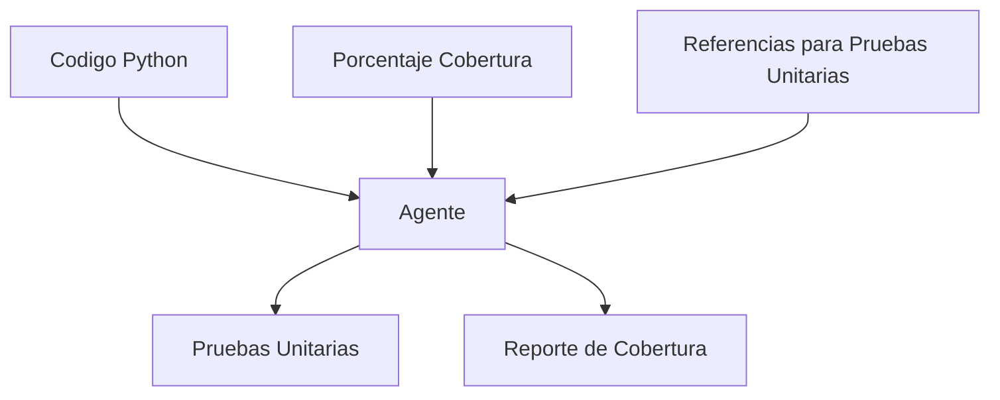
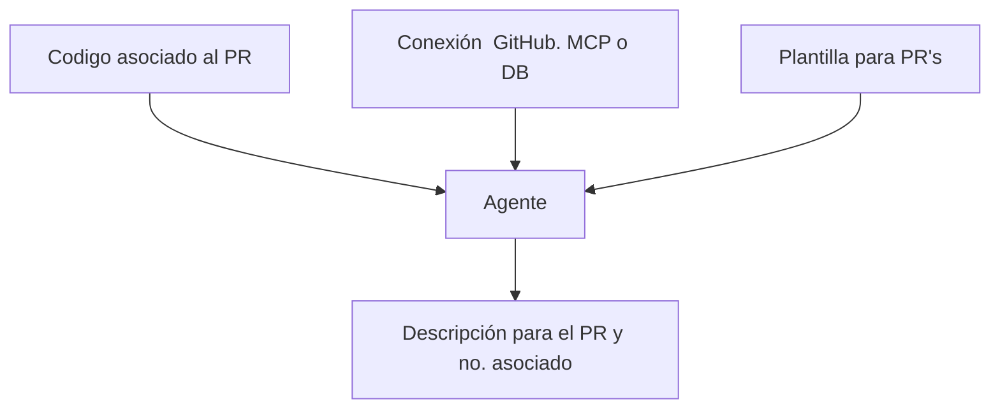
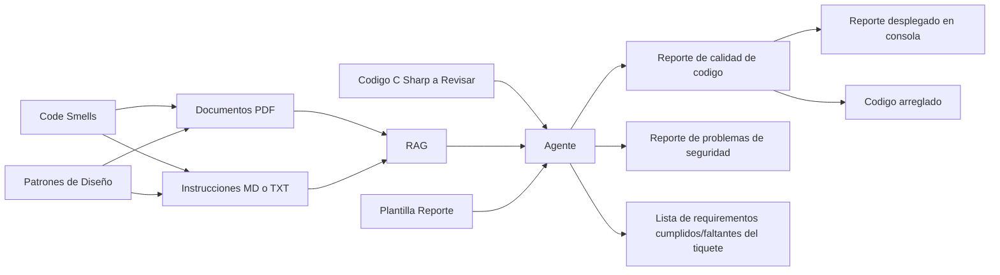

# Agente para pruebas unitarias

## Introducción

Agente encargado para realizar pruebas unitarias automáticas.
	Se define el lenguaje.
	Librería a usar (i.e: PyTest)
	Convención de nombres para las pruebas
	Cobertura esperada.



## Referencia externas (RAG)

- Documentación de PyTest
- Guías de Clean Code para pruebas
- Patrones de pruebas unitarias (AAA: Arrange, Act, Assert)
- Documentación de pytest-cov para cobertura

## Entradas Externas

1. Código de producción.
2. Cobertura esperada (ej: 80%).
3. Herramienta para generación de cobertura (pytest-cov).

## Salidas

1. Código de pruebas unitarias.
2. Cada prueba debe cumplir con los estándares requeridos.
3. Diagrama de cobertura.

## Ejemplo Completo - Python con PyTest

### Código de Producción (calculator.py)

```python
"""
Módulo de calculadora con operaciones básicas.
"""

class Calculator:
    """Calculadora con operaciones matemáticas básicas."""
    
    def add(self, a: float, b: float) -> float:
        """Suma dos números."""
        return a + b
    
    def subtract(self, a: float, b: float) -> float:
        """Resta dos números."""
        return a - b
    
    def multiply(self, a: float, b: float) -> float:
        """Multiplica dos números."""
        return a * b
    
    def divide(self, a: float, b: float) -> float:
        """Divide dos números."""
        if b == 0:
            raise ValueError("No se puede dividir por cero")
        return a / b
    
    def power(self, base: float, exponent: float) -> float:
        """Calcula la potencia de un número."""
        return base ** exponent
```

### Pruebas Unitarias Generadas (test_calculator.py)

```python
"""
Pruebas unitarias para el módulo calculator.
Cobertura esperada: 100%
"""

import pytest
from calculator import Calculator


class TestCalculator:
    """Suite de pruebas para la clase Calculator."""
    
    @pytest.fixture
    def calculator(self):
        """Fixture que proporciona una instancia de Calculator."""
        return Calculator()
    
    # Pruebas para el método add
    def test_add_positive_numbers(self, calculator):
        """Prueba suma de números positivos."""
        # Arrange
        a, b = 5, 3
        expected = 8
        
        # Act
        result = calculator.add(a, b)
        
        # Assert
        assert result == expected
    
    def test_add_negative_numbers(self, calculator):
        """Prueba suma de números negativos."""
        assert calculator.add(-5, -3) == -8
    
    def test_add_mixed_numbers(self, calculator):
        """Prueba suma de números positivos y negativos."""
        assert calculator.add(5, -3) == 2
    
    def test_add_with_zero(self, calculator):
        """Prueba suma con cero."""
        assert calculator.add(5, 0) == 5
    
    def test_add_decimals(self, calculator):
        """Prueba suma de números decimales."""
        result = calculator.add(1.5, 2.3)
        assert pytest.approx(result, 0.01) == 3.8
    
    # Pruebas para el método subtract
    def test_subtract_positive_numbers(self, calculator):
        """Prueba resta de números positivos."""
        assert calculator.subtract(10, 3) == 7
    
    def test_subtract_negative_result(self, calculator):
        """Prueba resta que resulta en número negativo."""
        assert calculator.subtract(3, 10) == -7
    
    def test_subtract_with_zero(self, calculator):
        """Prueba resta con cero."""
        assert calculator.subtract(5, 0) == 5
    
    # Pruebas para el método multiply
    def test_multiply_positive_numbers(self, calculator):
        """Prueba multiplicación de números positivos."""
        assert calculator.multiply(4, 5) == 20
    
    def test_multiply_by_zero(self, calculator):
        """Prueba multiplicación por cero."""
        assert calculator.multiply(5, 0) == 0
    
    def test_multiply_negative_numbers(self, calculator):
        """Prueba multiplicación de números negativos."""
        assert calculator.multiply(-3, -4) == 12
    
    def test_multiply_mixed_signs(self, calculator):
        """Prueba multiplicación con signos mixtos."""
        assert calculator.multiply(-3, 4) == -12
    
    # Pruebas para el método divide
    def test_divide_positive_numbers(self, calculator):
        """Prueba división de números positivos."""
        assert calculator.divide(10, 2) == 5
    
    def test_divide_with_remainder(self, calculator):
        """Prueba división con residuo."""
        result = calculator.divide(10, 3)
        assert pytest.approx(result, 0.01) == 3.33
    
    def test_divide_by_zero_raises_error(self, calculator):
        """Prueba que dividir por cero lanza ValueError."""
        with pytest.raises(ValueError, match="No se puede dividir por cero"):
            calculator.divide(10, 0)
    
    def test_divide_negative_numbers(self, calculator):
        """Prueba división de números negativos."""
        assert calculator.divide(-10, -2) == 5
    
    # Pruebas para el método power
    def test_power_positive_exponent(self, calculator):
        """Prueba potencia con exponente positivo."""
        assert calculator.power(2, 3) == 8
    
    def test_power_zero_exponent(self, calculator):
        """Prueba potencia con exponente cero."""
        assert calculator.power(5, 0) == 1
    
    def test_power_negative_exponent(self, calculator):
        """Prueba potencia con exponente negativo."""
        assert calculator.power(2, -2) == 0.25
    
    def test_power_fractional_exponent(self, calculator):
        """Prueba potencia con exponente fraccionario."""
        result = calculator.power(4, 0.5)
        assert pytest.approx(result, 0.01) == 2.0


# Pruebas parametrizadas para mayor cobertura
class TestCalculatorParametrized:
    """Pruebas parametrizadas para casos múltiples."""
    
    @pytest.mark.parametrize("a,b,expected", [
        (1, 1, 2),
        (0, 0, 0),
        (-1, 1, 0),
        (100, 200, 300),
        (0.1, 0.2, 0.3),
    ])
    def test_add_parametrized(self, a, b, expected):
        """Prueba suma con múltiples casos."""
        calculator = Calculator()
        result = calculator.add(a, b)
        assert pytest.approx(result, 0.01) == expected
    
    @pytest.mark.parametrize("a,b,expected", [
        (10, 2, 5),
        (9, 3, 3),
        (100, 4, 25),
        (-10, 2, -5),
    ])
    def test_divide_parametrized(self, a, b, expected):
        """Prueba división con múltiples casos."""
        calculator = Calculator()
        assert calculator.divide(a, b) == expected
```

### Configuración de PyTest (pytest.ini)

```ini
[pytest]
testpaths = tests
python_files = test_*.py
python_classes = Test*
python_functions = test_*
addopts =
    --verbose
    --cov=calculator
    --cov-report=html
    --cov-report=term-missing
    --cov-fail-under=80
markers =
    slow: marks tests as slow
    integration: marks tests as integration tests
```

### Comando para Ejecutar Pruebas

```bash
# Ejecutar todas las pruebas con reporte de cobertura
pytest --cov=calculator --cov-report=html --cov-report=term

# Ejecutar pruebas específicas
pytest tests/test_calculator.py::TestCalculator::test_add_positive_numbers

# Ejecutar con modo verbose
pytest -v

# Ejecutar y detener en el primer fallo
pytest -x
```

### Reporte de Cobertura Esperado

```
---------- coverage: platform win32, python 3.14.0 -----------
Name              Stmts   Miss  Cover   Missing
-----------------------------------------------
calculator.py        15      0   100%
-----------------------------------------------
TOTAL                15      0   100%

Coverage HTML written to dir htmlcov
```

### Estructura de Archivos del Proyecto

```
project/
├── calculator.py           # Código de producción
├── tests/
│   ├── __init__.py
│   └── test_calculator.py  # Pruebas unitarias
├── pytest.ini              # Configuración de pytest
├── requirements.txt        # Dependencias
└── htmlcov/               # Reporte HTML de cobertura
```

### Requirements.txt

```
pytest==7.4.0
pytest-cov==4.1.0
pytest-html==3.2.0
```


# Agente para generación de Pull Request



## Entradas Externas

1. Diff entre el branch y el branch objetivo.

```git
git diff origin/Development
```

2. No. de Tiquete en GitHub.
3. Plantilla para los Pull Requests del Repositorio.

## Salidas

1. Pull Request en GitHub con descripción completa y estructurada.

## Ejemplos de Casos de Uso - C#

### Ejemplo 1: Análisis de Cambios en un Feature Branch

**Entrada:**
```bash
# Diff del branch feature/user-authentication
git diff origin/development...feature/user-authentication

# Resultado del diff:
diff --git a/Services/AuthService.cs b/Services/AuthService.cs
+++ b/Services/AuthService.cs
@@ -10,6 +10,15 @@
+    public async Task<AuthResult> AuthenticateAsync(string username, string password)
+    {
+        var user = await _userRepository.GetByUsernameAsync(username);
+        if (user == null) return AuthResult.Failed("Usuario no encontrado");
+
+        var isValid = _passwordHasher.VerifyPassword(password, user.PasswordHash);
+        return isValid ? AuthResult.Success(user) : AuthResult.Failed("Contraseña incorrecta");
+    }

diff --git a/Controllers/AuthController.cs b/Controllers/AuthController.cs
+++ b/Controllers/AuthController.cs
@@ -5,0 +6,12 @@
+    [HttpPost("login")]
+    public async Task<IActionResult> Login([FromBody] LoginRequest request)
+    {
+        var result = await _authService.AuthenticateAsync(request.Username, request.Password);
+        if (!result.IsSuccess) return Unauthorized(result.ErrorMessage);
+
+        var token = _tokenGenerator.GenerateToken(result.User);
+        return Ok(new { Token = token });
+    }
```

**Salida Esperada del Agente:**
```markdown
## Descripción
Implementación del sistema de autenticación de usuarios con JWT.

## Issue Relacionado
Closes #245

## Cambios Realizados
- **Archivos modificados:** 5
- **Líneas añadidas:** 87
- **Líneas eliminadas:** 12

### Componentes Afectados:
**Backend - Servicios:**
- `Services/AuthService.cs` - Nuevo servicio de autenticación
- `Services/TokenGenerator.cs` - Generador de tokens JWT

**Backend - Controllers:**
- `Controllers/AuthController.cs` - Endpoint de login

**Modelos:**
- `Models/AuthResult.cs` - Modelo de resultado de autenticación
- `Models/LoginRequest.cs` - DTO para solicitud de login

## Tipo de Cambio
- [x] Nueva funcionalidad (sistema de autenticación)
- [ ] Bug fix
- [ ] Breaking change
- [ ] Documentación
```

### Ejemplo 2: Bug Fix con Múltiples Archivos

**Entrada:**
```bash
# Issue #189: NullReferenceException en ReportService
git diff origin/development...bugfix/report-null-reference

# Archivos modificados:
- Services/ReportService.cs (validación de null)
- Tests/ReportServiceTests.cs (nuevas pruebas)
- Models/Report.cs (propiedades nullable)
```

**Salida Esperada:**
```markdown
## Descripción
Corrección de NullReferenceException en generación de reportes cuando no hay datos.

## Issue Relacionado
Fixes #189

## Análisis del Problema
El servicio de reportes fallaba cuando se intentaba generar un reporte sin datos disponibles.

## Solución Implementada
- Agregada validación de null en `ReportService.GenerateAsync()`
- Propiedades del modelo `Report` marcadas como nullable
- Implementadas 5 nuevas pruebas unitarias para casos edge

## Tipo de Cambio
- [x] Bug fix (corrección de NullReferenceException)
- [ ] Nueva funcionalidad
- [ ] Breaking change
- [ ] Documentación

## Impacto
- **Severidad:** Alta (excepción en producción)
- **Usuarios afectados:** Todos los que generan reportes sin datos
- **Backward compatibility:** Mantenida
```

### Ejemplo 3: Refactorización de Código

**Entrada:**
```bash
# Refactorización de DatabaseContext
git diff origin/development...refactor/database-context

# Cambios principales:
- Extracción de configuraciones a clases separadas
- Implementación de patrón Repository
- Mejora en manejo de transacciones
```

**Salida Esperada:**
```markdown
## Descripción
Refactorización del DatabaseContext para mejorar mantenibilidad y testabilidad.

## Motivación
El DatabaseContext había crecido a más de 500 líneas con múltiples responsabilidades.

## Cambios Arquitectónicos

### Antes:
```csharp
public class DatabaseContext : DbContext
{
    // 500+ líneas con configuraciones mezcladas
    // Lógica de negocio en el contexto
    // Difícil de testear
}
```

### Después:
```csharp
public class DatabaseContext : DbContext
{
    // Configuraciones delegadas a EntityTypeConfiguration
}

public class UserRepository : IUserRepository
{
    // Lógica de acceso a datos separada
}
```

## Beneficios
- ✅ Separación de responsabilidades
- ✅ Código más testeable (inyección de dependencias)
- ✅ Configuraciones organizadas por entidad
- ✅ Reducción de 500 a 150 líneas en DatabaseContext

## Tipo de Cambio
- [ ] Bug fix
- [ ] Nueva funcionalidad
- [x] Refactorización (mejora de código sin cambio funcional)
- [ ] Documentación

## Testing
- Todas las pruebas existentes pasan sin modificación
- Agregadas 12 nuevas pruebas unitarias para repositories

# Agente Patito de Hule

## Introducción

Agente hecho para auditar código elaborado ya sea por otro agente o un humando. Identifica cualquier riesgo en seguridad, potencial pulgas. Puede recibir la descripción de un tiquete y verificar que el código cumple con esos requisitos.



Skills

1. find-code-smells
2. fix-code

Herramientas:

1. Leer archivo/código.
2. Escribir reporte.

Rag

1. Clean Code por Robert C. Martin

Archivo: ExcessiveComments.cs

### Resumen

**1. Respuesta directa**  
En el código de `InvoiceCalculator` se pueden identificar varios *code smells*: comentarios que simplemente repiten lo que hace el código, uso de un número mágico (1000), falta de validación de entrada (lista nula o vacía), responsabilidad múltiple (calcular total y decidir si hay descuento) y una oportunidad de simplificar el cálculo con LINQ o expresiones más idiomáticas.  

**2. Fundamento conceptual**  
- **Comentarios redundantes**: violan el principio de que el código debe ser autoexplicativo; los comentarios deben explicar *por qué* se hace algo, no *qué* se hace.  
- **Número mágico**: valores literales sin contexto dificultan el mantenimiento y ocultan la intención del negocio.  
- **Validación de entrada ausente**: pasar una referencia nula a un `foreach` lanza `NullReferenceException`; defenderse contra entradas inválidas mejora la robustez.  
- **Responsabilidad única (SRP)**: una clase debería tener una sola razón para cambiar. Aquí la clase mezcla cálculo de totales y lógica de descuento.  
- **Expresividad del lenguaje**: en C# moderno se puede usar LINQ (`Sum`) o expresiones de cuerpo para reducir ruido y mejorar legibilidad.  


### Code Smell Encontrados

1. Comentarios excesivos:

``` csharp
    public decimal CalculateTotal(List<InvoiceItem> items)
    {
        // Initialize total to zero.
        decimal total = 0;

        // Loop through every invoice item.
        foreach (var item in items)
        {
            // Multiply quantity by unit price.
            decimal subtotal = item.Quantity * item.UnitPrice;

            // Add subtotal to total.
            total += subtotal;
        }

        // Return the calculated total.
        return total;
    }
```

 2. Número Mágico:

 ```csharp
     public bool HasDiscount(decimal total)
    {
        // Check if total exceeds threshold.
        return total > 1000;
    }
 ```

1. **Creer que más comentarios = mejor código** – lleva a comentarios que envejecen mal y generan desincronía.  
2. **Dejar números mágicos sin explicar** – dificulta entender por qué se eligió ese valor y obliga a buscar en todo el código cuando cambia.  
3. **No validar argumentos de entrada** – asume que los llamadores siempre pasarán datos válidos, lo que genera fallos en producción.  
4. **Mezclar varias responsabilidades en una misma clase** – viola SRP y hace que cambios en una característica afecten a otra sin razón aparent


## Entradas

1. Diff entre el branch y el branch objetivo

```git
git diff origin/Development
```

2. Tiquete asociado (opcional)

## Salidas

Reporte con faltas encontradas por el agente. Incluir el grado de severidad y el tipo de incumplimiento (seguridad, code smell, discrepancias).

## Ejemplos de Casos de Uso - C#

### Ejemplo 1: Detección de Vulnerabilidades de Seguridad

**Código a Auditar:**
```csharp
// UserController.cs
public class UserController : ControllerBase
{
    [HttpPost("login")]
    public IActionResult Login(string username, string password)
    {
        // ⚠️ PROBLEMA: SQL Injection vulnerable
        var query = $"SELECT * FROM Users WHERE Username = '{username}' AND Password = '{password}'";
        var user = _db.ExecuteQuery(query);
        
        if (user != null)
        {
            // ⚠️ PROBLEMA: Contraseña en texto plano
            return Ok(new { Token = GenerateToken(user) });
        }
        
        return Unauthorized();
    }
    
    [HttpGet("user/{id}")]
    public IActionResult GetUser(int id)
    {
        // ⚠️ PROBLEMA: Sin autorización
        var user = _userService.GetById(id);
        return Ok(user);
    }
}
```

**Reporte del Agente:**
```markdown
# 🔴 Reporte de Auditoría de Código

## Resumen Ejecutivo
- **Score de Calidad:** 35/100 ❌
- **Vulnerabilidades Críticas:** 3
- **Code Smells:** 2
- **Recomendación:** RECHAZAR - Requiere correcciones inmediatas

---

## 🔴 CRÍTICO - Vulnerabilidades de Seguridad

### 1. SQL Injection (Línea 7)
**Severidad:** CRÍTICA 🔴  
**Categoría:** Seguridad - Inyección SQL  
**CWE:** CWE-89

**Problema:**
```csharp
var query = $"SELECT * FROM Users WHERE Username = '{username}' AND Password = '{password}'";
```

**Riesgo:**
Un atacante puede inyectar código SQL malicioso:
- Input: `username = "admin' OR '1'='1"`
- Resultado: Bypass de autenticación

**Solución Recomendada:**
```csharp
// Usar parámetros preparados
var query = "SELECT * FROM Users WHERE Username = @username AND Password = @password";
var user = _db.ExecuteQuery(query, new { username, password });
```

---

### 2. Contraseñas en Texto Plano (Línea 7)
**Severidad:** CRÍTICA 🔴  
**Categoría:** Seguridad - Almacenamiento Inseguro  
**CWE:** CWE-256

**Problema:**
Las contraseñas se comparan directamente sin hashing.

**Solución Recomendada:**
```csharp
// Usar BCrypt o similar
var isValid = BCrypt.Net.BCrypt.Verify(password, user.PasswordHash);
```

---

### 3. Falta de Autorización (Línea 17)
**Severidad:** ALTA 🟠  
**Categoría:** Seguridad - Control de Acceso  
**CWE:** CWE-862

**Problema:**
Cualquier usuario puede acceder a información de otros usuarios.

**Solución Recomendada:**
```csharp
[Authorize]
[HttpGet("user/{id}")]
public IActionResult GetUser(int id)
{
    // Verificar que el usuario solo acceda a su propia información
    if (User.GetUserId() != id && !User.IsInRole("Admin"))
        return Forbid();
    
    var user = _userService.GetById(id);
    return Ok(user);
}
```

---

## 📊 Métricas de Calidad

| Métrica | Valor | Estado |
|---------|-------|--------|
| Vulnerabilidades Críticas | 3 | ❌ |
| Vulnerabilidades Altas | 1 | ❌ |
| Code Smells | 2 | ⚠️ |
| Cobertura de Pruebas | 0% | ❌ |
| Complejidad Ciclomática | 5 | ✅ |

---

## ✅ Checklist de Correcciones

- [ ] Implementar consultas parametrizadas (SQL Injection)
- [ ] Implementar hashing de contraseñas (BCrypt/Argon2)
- [ ] Agregar atributo [Authorize] y validación de permisos
- [ ] Implementar validación de modelos con Data Annotations
- [ ] Agregar logging de intentos de acceso
- [ ] Implementar rate limiting para prevenir fuerza bruta
- [ ] Agregar pruebas unitarias (mínimo 80% cobertura)

---

### Ejemplo 2: Detección de Code Smells y Malas Prácticas

**Código a Auditar:**
```csharp
// OrderService.cs
public class OrderService
{
    public void ProcessOrder(Order order)
    {
        // ⚠️ PROBLEMA: Método muy largo (God Method)
        if (order == null) throw new Exception("Order is null");
        
        if (order.Items.Count == 0) throw new Exception("No items");
        
        var total = 0.0;
        foreach (var item in order.Items)
        {
            total += item.Price * item.Quantity;
            if (item.Quantity > 100)
            {
                total = total * 0.9; // 10% descuento
            }
        }
        
        if (order.Customer.Type == "Premium")
        {
            total = total * 0.95; // 5% descuento adicional
        }
        
        // ⚠️ PROBLEMA: Lógica de negocio mezclada con acceso a datos
        var connection = new SqlConnection("...");
        connection.Open();
        var command = new SqlCommand($"INSERT INTO Orders VALUES ({order.Id}, {total})", connection);
        command.ExecuteNonQuery();
        
        // ⚠️ PROBLEMA: No se cierra la conexión
        // ⚠️ PROBLEMA: No hay manejo de errores
        
        // Enviar email
        var smtp = new SmtpClient();
        smtp.Send("from@example.com", order.Customer.Email, "Order Confirmed", $"Total: {total}");
    }
}
```

**Reporte del Agente:**
```markdown
# 🟡 Reporte de Auditoría de Código

## Resumen Ejecutivo
- **Score de Calidad:** 45/100 ⚠️
- **Violaciones de SOLID:** 4
- **Code Smells:** 6
- **Recomendación:** REQUIERE REFACTORIZACIÓN

---

## 🟠 ALTO - Violaciones de Principios SOLID

### 1. Violación del Principio de Responsabilidad Única (SRP)
**Severidad:** ALTA 🟠  
**Líneas:** 5-35

**Problema:**
El método `ProcessOrder` tiene múltiples responsabilidades:
- Validación de orden
- Cálculo de precios y descuentos
- Persistencia en base de datos
- Envío de emails

**Impacto:**
- Difícil de testear
- Difícil de mantener
- Alto acoplamiento

**Solución Recomendada:**

```csharp
public class OrderService
{
    private readonly IOrderValidator _validator;
    private readonly IPricingService _pricingService;
    private readonly IOrderRepository _repository;
    private readonly IEmailService _emailService;
    
    public async Task ProcessOrderAsync(Order order)
    {
        // Validación
        var validationResult = await _validator.ValidateAsync(order);
        if (!validationResult.IsValid)
            throw new ValidationException(validationResult.Errors);
        
        // Cálculo de precio
        var total = await _pricingService.CalculateTotalAsync(order);
        
        // Persistencia
        await _repository.SaveAsync(order, total);
        
        // Notificación
        await _emailService.SendOrderConfirmationAsync(order, total);
    }
}
```

---

### 2. God Method / Método Muy Largo
**Severidad:** MEDIA 🟡  
**Complejidad Ciclomática:** 8 (Límite recomendado: 5)

**Problema:**
Método con más de 30 líneas y múltiples niveles de anidación.

**Solución:**
Dividir en métodos más pequeños con responsabilidades únicas.

---

### 3. Fuga de Recursos (Resource Leak)
**Severidad:** ALTA 🟠  
**Línea:** 24-26

**Problema:**
```csharp
var connection = new SqlConnection("...");
connection.Open();
// No se cierra la conexión
```

**Solución:**
```csharp
using (var connection = new SqlConnection("..."))
{
    connection.Open();
    // ... operaciones
} // Se cierra automáticamente
```

---

## 📊 Análisis de Complejidad

```
Método: ProcessOrder
├── Complejidad Ciclomática: 8 ⚠️ (Límite: 5)
├── Líneas de Código: 32 ⚠️ (Límite: 20)
├── Parámetros: 1 ✅
├── Niveles de Anidación: 3 ⚠️ (Límite: 2)
└── Dependencias: 3 (SqlConnection, SmtpClient, Order)
```

---

## ✅ Checklist de Mejoras

- [ ] Dividir método en servicios separados (SRP)
- [ ] Implementar using statements para recursos
- [ ] Agregar manejo de errores con try-catch
- [ ] Reemplazar strings mágicos con enums
- [ ] Implementar inyección de dependencias
- [ ] Agregar logging
- [ ] Crear pruebas unitarias para cada servicio
- [ ] Reducir complejidad ciclomática a < 5

---

### Ejemplo 3: Verificación de Cumplimiento con Requisitos del Ticket

**Ticket #456:**
```markdown
## Requisitos
- Implementar endpoint para actualizar perfil de usuario
- Validar que el email sea único
- Solo el usuario propietario o admin puede actualizar
- Registrar cambios en audit log
- Retornar 404 si usuario no existe
- Retornar 403 si no tiene permisos
```

**Código Implementado:**
```csharp
[HttpPut("users/{id}")]
public IActionResult UpdateUser(int id, UpdateUserRequest request)
{
    var user = _userService.GetById(id);
    
    user.Name = request.Name;
    user.Email = request.Email;
    
    _userService.Update(user);
    
    return Ok(user);
}


**Reporte del Agente:**

# ❌ Verificación de Cumplimiento - Ticket #456

## Resumen
**Estado:** INCOMPLETO ❌  
**Requisitos Cumplidos:** 1/6 (17%)

---

## ✅ Requisitos Cumplidos

1. ✅ Endpoint implementado (`PUT /users/{id}`)

---

## ❌ Requisitos NO Cumplidos

### 2. ❌ Validación de email único
**Estado:** NO IMPLEMENTADO  
**Impacto:** ALTO

**Código Faltante:**
```csharp
var existingUser = await _userService.GetByEmailAsync(request.Email);
if (existingUser != null && existingUser.Id != id)
    return Conflict("Email ya está en uso");
```

---

### 3. ❌ Autorización (usuario propietario o admin)
**Estado:** NO IMPLEMENTADO  
**Impacto:** CRÍTICO - Vulnerabilidad de seguridad

**Código Faltante:**
```csharp
[Authorize]
[HttpPut("users/{id}")]
public async Task<IActionResult> UpdateUser(int id, UpdateUserRequest request)
{
    var currentUserId = User.GetUserId();
    if (currentUserId != id && !User.IsInRole("Admin"))
        return Forbid();
    
    // ... resto del código
}
```

---

### 4. ❌ Audit Log
**Estado:** NO IMPLEMENTADO  
**Impacto:** MEDIO

**Código Faltante:**
```csharp
await _auditService.LogAsync(new AuditEntry
{
    UserId = currentUserId,
    Action = "UpdateUser",
    EntityId = id,
    Changes = GetChanges(originalUser, updatedUser),
    Timestamp = DateTime.UtcNow
});
```

---

### 5. ❌ Retornar 404 si usuario no existe
**Estado:** NO IMPLEMENTADO  
**Impacto:** MEDIO

**Problema Actual:**
```csharp
var user = _userService.GetById(id); // Puede retornar null
user.Name = request.Name; // NullReferenceException
```

**Código Correcto:**
```csharp
var user = await _userService.GetByIdAsync(id);
if (user == null)
    return NotFound($"Usuario con ID {id} no encontrado");
```

---

## ✅ Checklist de Correcciones

- [ ] Agregar atributo [Authorize]
- [ ] Implementar verificación de permisos (propietario o admin)
- [ ] Validar que usuario existe (404)
- [ ] Validar email único (409 Conflict)
- [ ] Implementar audit logging
- [ ] Agregar validación de modelo
- [ ] Manejar errores apropiadamente
- [ ] Agregar pruebas unitarias para cada caso