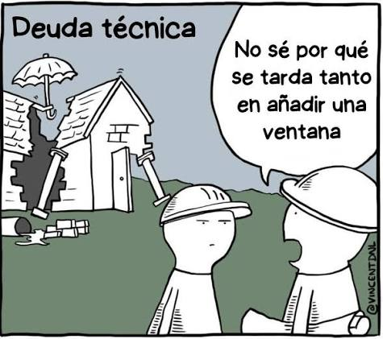
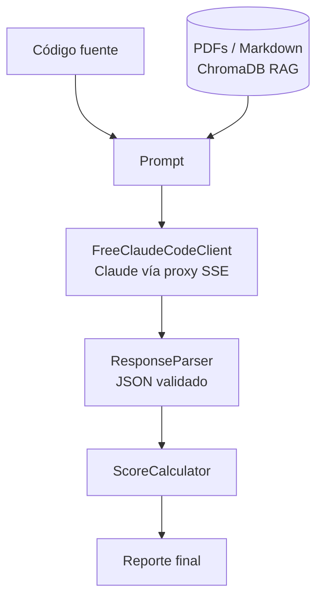
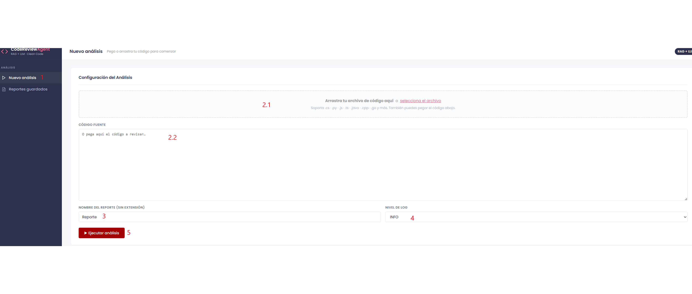
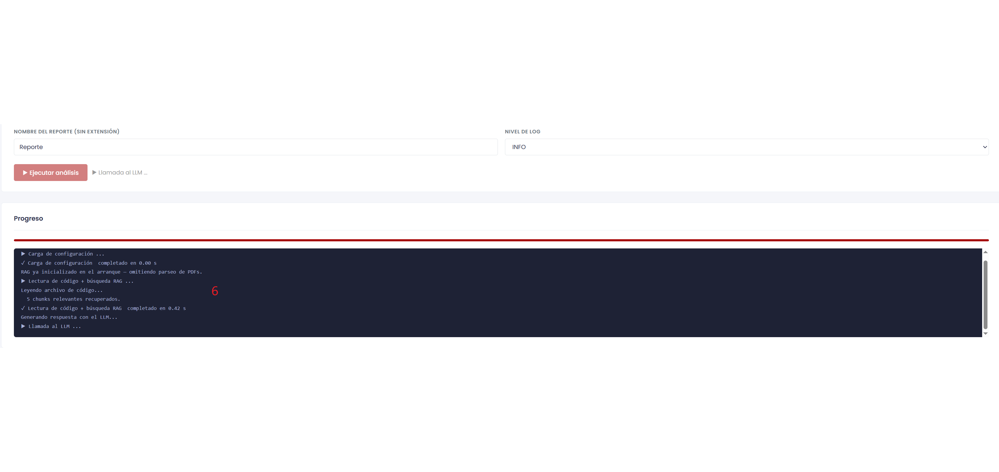
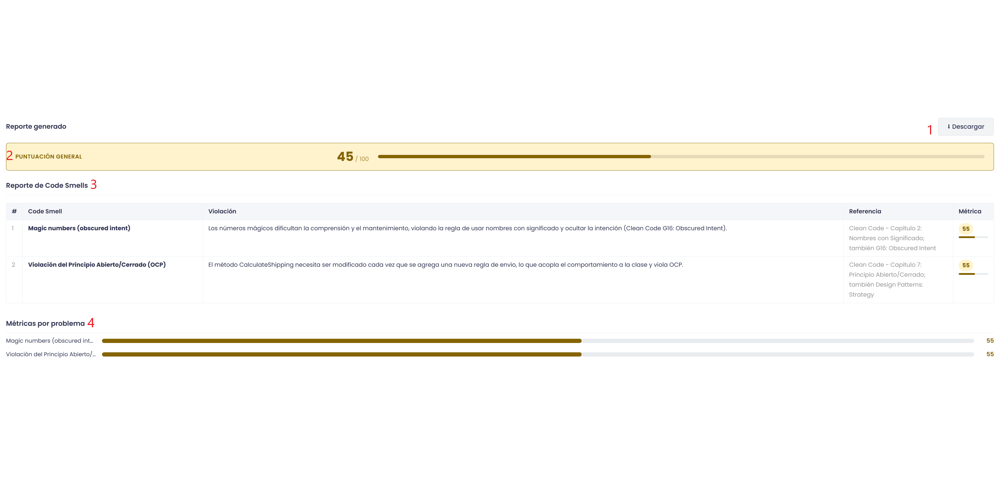
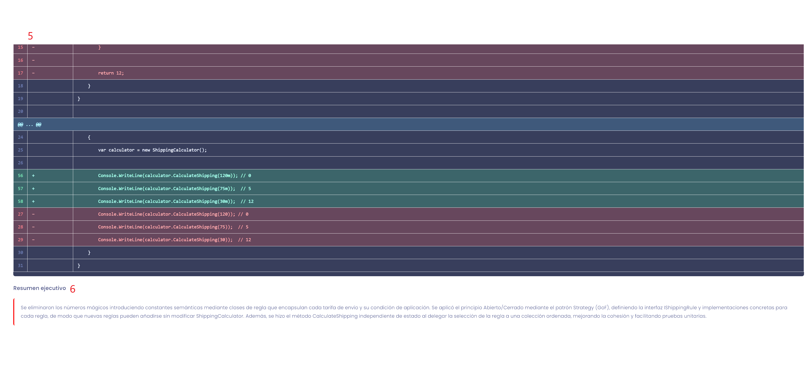
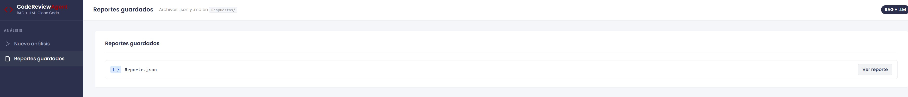

# Agente para Calidad de Código

## Motivación

En la industria y en la educación, por las constantes fechas de entregables y cortos lapsos de tiempo, el desarrollo Software se enfoca nada mas en "Que funcione". Sin embargo, esto puede generar deudas técnicas. 

### Causas

- Prisas en el desarrollo
- Falta de requerimientos
- Falta de documentacion *

Una aplicación con pobre calidad en su código con lleva a varias consecuencias.

### Consecuencias

- Relentización en el Desarollo
- Aumento de Bugs
- Fuga de Talento y Frustración
 
 <br>
 <br>



## Introducción

Se muestra el desarrollo de un Agente IA para detectar `code smells` mas comúnes.

### Catálogo de Code Smells Detectables

| # | Code Smell | Principio Violado | Severidad Típica |
|---|---|---|---|
| 1 | Comentarios excesivos o redundantes | KISS | Baja |
| 2 | Números mágicos | DRY, KISS | Media |
| 3 | Malos nombres (notación húngara, abreviaturas, nombres engañosos) | KISS | Media |
| 4 | Función que hace más de lo que su nombre indica | SRP, KISS | Alta |
| 5 | Lista de parámetros larga | SRP, KISS | Media |
| 6 | Clase Dios *(God Class)* | SRP, DRY | Alta |
| 7 | Obsesión primitiva *(Primitive Obsession)* | SRP, OCP | Media |
| 8 | Acoplamiento excesivo *(Feature Envy / Inappropriate Intimacy)* | DIP, SRP | Alta |
| 9 | Clases incompletas o sin cohesión *(Lazy Class / Incomplete Class)* | YAGNI, SRP | Baja |
| 10 | Código duplicado | DRY | Alta |
| 11 | Ausencia de validación de entrada | SRP | Media |
| 12 | Violación de SRP (clase con múltiples responsabilidades) | SRP | Alta |
| 13 | Switch Statements / Complejidad Condicional *(Conditional Complexity)* | OCP, SRP | Alta |

## ¿Por qué un Agente?

Detectar problemas de código require razonamiento el cual código de alto nivel no provee. Un LLM facilita esta tarea, dejando la parte de arquitectura, Front End y Back End como solución en Software.


## Arquitectura

La solución consiste en un LLM conectado a un modelo libre de [free-claude](https://github.com/Alishahryar1/free-claude-code). El prompt es definido para que solo se enfoque en el propósito espeficado. Se tiene a disposición referencias bibliográficas del tema las cuales son alimentados al sistema.

## Estructura Proyecto

```
Agente/
├── main.py                        # Punto de entrada CLI
├── config.json                    # Configuración del RAG (rutas, colección Chroma)
├── core/
│   ├── config.py                  # LLMConfig: URL, API key, modelo, temperatura
│   ├── llm_client.py              # FreeClaudeCodeClient — streaming SSE + tool calling
│   ├── response_parser.py         # Parseo y validación del JSON devuelto por el LLM
│   ├── agent_logger.py            # Logger estructurado con timer y sink para la UI
│   ├── user_inputs.py             # Dataclass UserConfig (archivo, tarea, formato, salida)
│   └── chroma_db/
│       ├── rag_config.py          # Configuración del vector store (Chroma)
│       ├── pdf_processor.py       # Extracción y chunking de PDFs bibliográficos
│       ├── markdown_processor.py  # Extracción y chunking de archivos Markdown
│       ├── vector_store.py        # Wrapper de ChromaDB (add / search)
│       └── rag_agent.py           # Agente RAG de alto nivel
├── dashboard/
│   ├── app.py                     # Servidor Flask — rutas REST + SSE
│   ├── worker.py                  # Pipeline de análisis en hilo de fondo
│   ├── score_calculator.py        # Cálculo de puntuación de calidad
│   ├── templates/
│   │   ├── index.html             # Página principal: editor + log en vivo
│   │   └── reports.html           # Visor de reportes guardados
│   └── static/
│       ├── style.css
│       ├── main.js                # Lógica de análisis y streaming SSE
│       └── reports.js             # Lógica del visor de reportes
├── Ejemplos/                      # Archivos de código de prueba (.cs)
├── Respuestas/                    # Reportes generados (JSON / Markdown)
└── logs/                          # Trazas por ejecución (llm_raw, cleaned, final)
```

## Generación Aumentada por Recuperación

Por medio de RAG, se facilita la inyección de literatura externa para que el LLM procese. Para esta aplicación, se realiza la inyección de archivos formato `PDF` y `markdown`. Por medio de Chroma DB son traducidos a chunks. Finalmente, son interpretados por el LLM.

| # | Documento | Uso principal |
|---|---|---|
| 1 | Martin, R. C. (2008). *Clean Code: A Handbook of Agile Software Craftsmanship*. Prentice Hall. | Definiciones canónicas de code smells, reglas de nombrado, principios de funciones y clases. |
| 2 | Catálogo de code smells detectables (este documento) | Mapeo de smells → principios violados → severidad → refactorizaciones recomendadas. |
| 3 | Gamma, E., Helm, R., Johnson, R., & Vlissides, J. (1994). *Design Patterns: Elements of Reusable Object-Oriented Software*. Addison-Wesley. | Patrones creacionales, estructurales y de comportamiento que el agente sugiere como refactorizaciones (Strategy, Factory, Decorator, Observer, etc.). |


### Flujo de Datos



## ScoreCalculator

El `ScoreCalculator` traduce las etiquetas cualitativas de severidad que devuelve el LLM en valores numéricos, y deriva una **puntuación general de calidad** del archivo analizado.

### Mapeo de Severidad

Cada *code smell* detectado recibe una etiqueta de severidad (`critico`, `mayor`, `menor`). El calculador la convierte en un valor de impacto (0–100) que representa cuánto daña ese smell a la calidad del código:

| Severidad | Impacto |
|-----------|---------|
| `critico` | 85 |
| `mayor`   | 55 |
| `menor`   | 20 |

### Puntuación General

```
puntuacion_general = 100 − promedio(impactos)
```

- Si no hay *code smells* detectados → puntuación = **100**.
- El resultado se redondea y se limita al rango **[0, 100]**.
- Una puntuación alta significa código de mayor calidad; una baja indica acumulación de problemas severos.

**Ejemplo:**

| Smell detectado | Severidad | Impacto |
|---|---|---|
| Clase Dios | `critico` | 85 |
| Números mágicos | `mayor` | 55 |
| Comentarios redundantes | `menor` | 20 |

```
puntuacion_general = 100 − (85 + 55 + 20) / 3 = 100 − 53.3 ≈ 47
```

### Integración en el Pipeline

El `ScoreCalculator` se invoca después del `ResponseParser`, enriqueciendo el JSON con dos campos adicionales antes de enviarlo al frontend:

- `metrica` — campo añadido a cada entrada del arreglo `reporte`.
- `puntuacion_general` — campo añadido a la raíz del objeto JSON.

### Ejemplo de Reporte

```json
{
  "reporte": [
    {
      "id": "1",
      "code_smell": "Single Responsibility Principle Violation",
      "violacion": "RegisterUser valida, persiste y envía correo en un solo método.",
      "referencia": "Clean Code - Cap. 3: Funciones (Hacer una sola cosa)",
      "severidad": "critico",
      "metrica": 85
    },
    {
      "id": "2",
      "code_smell": "Primitive Obsession",
      "violacion": "Se usan strings primitivos para nombre y email sin encapsulación.",
      "referencia": "Clean Code - Cap. 2: Nombres Significativos",
      "severidad": "menor",
      "metrica": 20
    }
  ],
  "resumen_ejecutivo": "Se detectaron 2 code smells. Se recomienda separar responsabilidades e introducir value objects para nombre y email.",
  "puntuacion_general": 47
}
```

## Interfaz

La interfaz es una aplicación web servida con **Flask** accesible en `http://127.0.0.1:5000`.

### Página principal — Nuevo análisis

- **Editor de código** : área de texto donde se pega el código fuente a analizar [2].
- **Nombre del reporte**: campo para asignar un identificador al resultado guardado [3].
- **Botón Analizar**: envía el código al backend, que lanza el pipeline en un hilo de fondo [5].
- **Log en vivo**: panel de progreso por *Server-Sent Events* (SSE) — muestra cada etapa en tiempo real (carga RAG → llamada LLM → guardado) [6].
- **Panel de resultados**: muestra los *code smells* detectados con severidad, fragmentos afectados y sugerencias de corrección. Incluye botón de descarga en JSON.





### Reporte



- **Botón Descargar**: Botón para descargar reporte en formato JSON [1].

- **Califación**: Nivel de limpieza el código analizado presenta [2].

- **Reporte de Code Smells**: Resumen con principales `Code Smells` encontrados [3].

- **Métricas por Problema**: Métricas segun los problemas encontrados [4].



- **Código arreglado**: Disponible en formato .cs y .diff con respecto al archivo original [5].

- **Califación**: Nivel de limpieza el código analizado presenta [6].

### Historial de Reportes

- Lista todos los reportes guardados en `Respuestas/` (JSON y Markdown), ordenados del más reciente al más antiguo.
- Al seleccionar un reporte se despliega su contenido completo, incluyendo la puntuación de calidad calculada por el `ScoreCalculator`.

